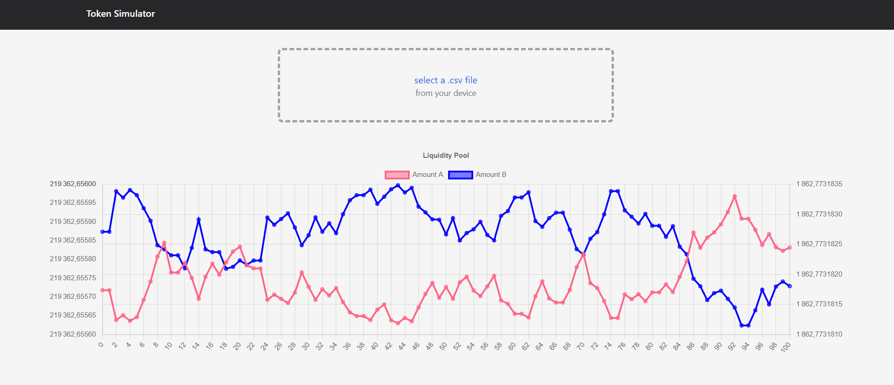

# Front-end

The front-end is a PWA Next.js application. You can install it and run it offline.

### How does it work ?

- The developer create a netlist and the methods to call the smart contracts you want to test
- Run the back-end locally
```bash
cd backend
npm start
```
:::info

The server is now running on `http://localhost:4000/`

:::
- Use the front-end to modify the parameters of the simulation without having to modify the code
- Generate .csv and .txt output files + the associated chart



🚧 Under construction 🚧